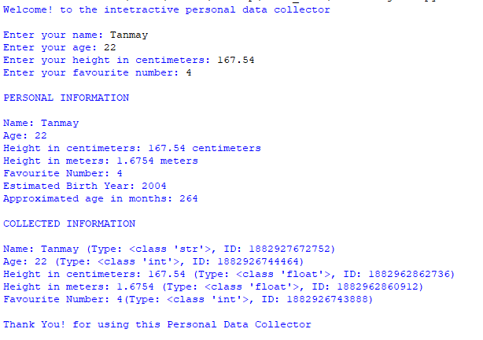

# Fundamental-Booster-Project-1-
Interactive Python project demonstrating fundamental programming concepts, data types, type casting, operators, and user input.
# 🐍 Interactive Personal Data Collector

> A beginner-friendly Python console application that collects personal information and demonstrates fundamental Python programming concepts.

---

## 📌 About the Project

The **Interactive Personal Data Collector** is a simple Python program designed to demonstrate the fundamentals of Python programming through an interactive console experience.

The program asks the user for basic personal information such as their name, age, height, and favourite number. It then performs simple calculations and displays the collected information along with its data type and object identity.

This project was created as part of learning and practicing **Python fundamentals**.

---

## ✨ Features

- 👤 Collects the user's name
- 🎂 Collects the user's age
- 📏 Accepts height in centimeters
- 🔢 Collects a favourite number
- 📅 Calculates an estimated birth year
- 📆 Calculates approximate age in months
- 📐 Converts height from centimeters to meters
- 🧩 Demonstrates type casting
- 🔍 Displays variable data types using `type()`
- 🆔 Displays object identities using `id()`
- 💬 Uses formatted strings for clean output

---

## 🧠 Python Concepts Demonstrated

This project demonstrates several important Python fundamentals:

| Concept | Example |
|---|---|
| `input()` | Getting information from the user |
| `print()` | Displaying information |
| Variables | `name`, `age`, `height_cm` |
| String | `name` |
| Integer | `age`, `favourite_number` |
| Float | `height_cm`, `height_m` |
| Type Casting | `int()` and `float()` |
| Addition | `age + ...` |
| Subtraction | `current_year - age` |
| Multiplication | `age * 12` |
| Division | `height_cm / 100` |
| Formatted Strings | `f"Name: {name}"` |
| `type()` | Checking a variable's data type |
| `id()` | Checking an object's identity |

---

## 🧮 Calculations Used

### Estimated Birth Year

The program estimates the user's birth year using:

```python
birth_year = current_year - age


## 🖥️ Example Output

Here is an example of the program running in the Python console:


